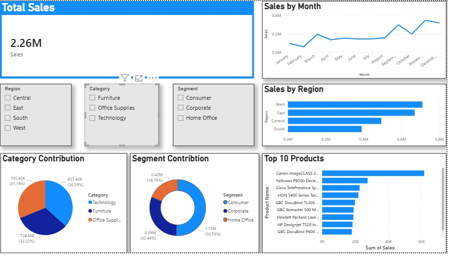

# 📊 Retail Sales Analytics Dashboard

An interactive Business Intelligence dashboard developed using **Power BI**, **SQL**, and **Microsoft Excel** to analyze retail sales performance, identify business trends, and generate actionable insights for management decision-making.

---

## 📷 Dashboard Preview

### Executive Dashboard



---

## 📁 Repository Structure

```text
Retail-Sales-Analytics/
│
├── Dashboard/
│   └── Retail_Dashboard.png
│
├── Dataset/
│   └── Retail_Sales_Dataset.xlsx
│
├── SQL/
│   └── Retail_Sales_Queries.sql
│
├── Retail_Sales_Dashboard.pbix
│
└── README.md
```

---

# 📌 Project Overview

The Retail Sales Analytics Dashboard is an interactive business intelligence solution developed using Power BI, SQL, and Excel to analyze retail sales performance. The dashboard consolidates sales data into meaningful visualizations, enabling management to monitor key performance indicators (KPIs), identify business trends, evaluate regional and product performance, and support data-driven decision-making. The solution transforms raw transactional data into actionable insights that improve operational visibility and strategic planning.

---

## 🔄 Project Workflow

```text
Business Requirement
        ↓
Data Collection
        ↓
Data Cleaning (Excel / SQL)
        ↓
Data Modeling
        ↓
Power BI Dashboard
        ↓
Business Insights
        ↓
Management Recommendations
```

---

# 💼 Business Problem

Retail businesses generate large volumes of sales data across multiple regions, customer segments, and product categories. Analyzing this information manually is time-consuming and often fails to provide timely insights for decision-makers. Management required a centralized dashboard to identify high- and low-performing regions, understand customer purchasing behavior, evaluate product performance, monitor seasonal sales trends, and support strategic decisions aimed at improving revenue and operational efficiency.

---

# 🎯 Project Objectives

- Develop an interactive Power BI dashboard to monitor retail sales performance.
- Track key business KPIs including Total Sales, Total Orders, Average Order Value, Customer Segments, Product Categories, and Regional Performance.
- Identify sales trends, seasonal patterns, and customer purchasing behavior.
- Analyze high- and low-performing regions, categories, and products to uncover business opportunities.
- Generate actionable insights and recommendations to support management in improving sales performance, marketing strategies, and inventory planning.

---

# 🗂 Dataset Description

The dataset contains retail sales transactions, including customer details, product information, sales values, discounts, profit, order dates, shipping details, and regional information. The data was used to analyze business performance across regions, customer segments, product categories, and seasonal trends. It provides a realistic business scenario for developing interactive dashboards and generating actionable insights.

---

# 🛠 Tools Used

- Power BI
- SQL
- Microsoft Excel
- Power Query
- DAX

---

# 📈 KPIs Measured

- Total Sales
- Total Orders
- Average Order Value
- Total Profit
- Profit Margin
- Regional Sales Performance
- Customer Segment Performance
- Product Category Contribution
- Top 10 Customers
- Top Selling Products
- Monthly Sales Trend
- Seasonal Sales Performance
- Category Contribution Percentage

---

# 📊 Dashboard Features

- Executive KPI Cards
- Regional Sales Analysis
- Customer Segment Analysis
- Product Category Analysis
- Top Customers Analysis
- Top Products Analysis
- Monthly Sales Trend
- Interactive Filters and Slicers
- Dynamic Visualizations

---

# 💡 Key Insights

- The West region generated the highest overall sales revenue, demonstrating strong market performance.
- The South region exhibited a different seasonal sales pattern compared to other regions, indicating the need for localized business strategies.
- The Consumer segment contributed the highest share of total sales, making it the primary customer segment.
- Technology emerged as the highest-performing product category, while overall sales remained diversified across multiple categories.
- Sales activity peaked during November and December, highlighting strong seasonal demand and opportunities for inventory optimization.

---

# 📋 Business Recommendations

- Conduct a detailed investigation into the South region to identify the factors driving its unique seasonal sales pattern and optimize regional sales strategies.
- Increase marketing efforts toward medium-value customers to strengthen customer retention and sustainable revenue growth.
- Align inventory planning with seasonal demand, particularly during high-sales periods such as November and December.
- Continue investing in high-performing product categories while identifying opportunities to improve underperforming categories.
- Use regional and customer-segment performance analysis to support targeted marketing campaigns and resource allocation.

---

# ⚠ Challenges

- Cleaning and validating data collected from multiple business sources.
- Creating a scalable data model capable of supporting interactive dashboard analysis.
- Designing meaningful KPIs that accurately reflect business performance.
- Presenting complex sales data in a simple, executive-friendly dashboard.
- Transforming raw transactional data into actionable business insights.

---

# 📈 Business Impact

This dashboard enables management to monitor sales performance in real time, identify underperforming regions, optimize inventory planning based on seasonal demand, improve marketing decisions through customer segmentation, and support data-driven business growth through actionable insights.

---

# 🧠 Skills Demonstrated

- Power BI
- SQL
- Business Intelligence
- Data Analysis
- Dashboard Development
- KPI Development
- Data Visualization
- DAX
- Power Query
- Trend Analysis
- Business Insights
- Executive Reporting
- Performance Reporting
- Decision Support
- Analytical Thinking

---

# 👨‍💻 About the Author

**Umair Anwar**

**Data Analyst | Power BI | SQL | Excel | Business Intelligence | KPI Reporting**

- **LinkedIn:** https://linkedin.com/in/misterumairanwar
- **GitHub:** https://github.com/MerryDataAnalyst
